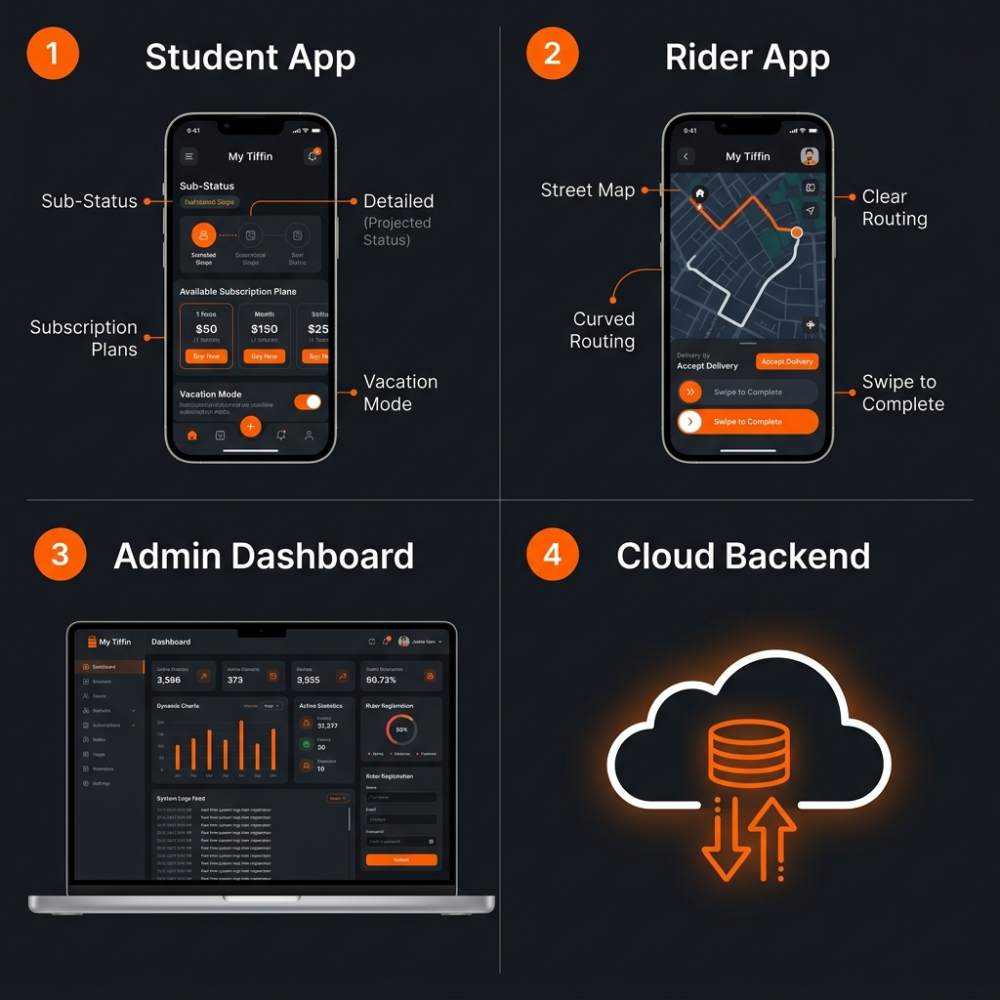

# 🛵 My Tiffin — Premium Real-Time Tiffin Delivery & Fleet System

A premium, state-of-the-art, and real-time **Tiffin Delivery & Management System** designed to bridge the gap between Students, Riders, and Kitchen Administrators. Built with a mono-repo structure, it integrates hardware-accelerated SVG animations, live street-following GPS simulation, interactive analytics, and bulk order workflow triggers.



---

## 🏛️ Project Architecture (Mono-Repo)

The workspace is organized into four decoupled, highly integrated services:

```text
My Tiffin app/
├── tiffin-backend/      # Express.js REST & WebSockets Server
├── admin-dashboard/     # React + Vite Administrative Hub (Desktop/Mobile Web)
├── student-tiffin/      # Expo React Native App (for Students)
└── rider-app/           # Expo React Native App (for Delivery Fleet)
```

---

## 🌟 Key Features

### 1. 🎓 Student Mobile App (`student-tiffin`)
* **Flexible Subscriptions**: Choose between `Basic`, `Standard`, or `Premium` daily meal plans with instant wallet billing.
* **Multi-Order Concurrent Tracking**: A customized horizontal tab-list selector that allows students to track multiple active orders (e.g., lunch, dinner, extra snacks) simultaneously in real-time.
* **Vacation Safeguard**: A single toggle to pause deliveries and freeze deductions while on holiday.
* **Live Telemetry & Navigation**: Track deliveries second-by-second with live ETA updates calculated dynamically based on the rider's physical GPS coordinate broadcasts. Includes a fallback MapView using Leaflet inside WebViews.
* **Premium Micro-Animations**: Features a custom 60 FPS hardware-accelerated SVG delivery animation (Scooter bouncy movements, spinning wheels, steam rising from tiffins).
* **Detailed Rating Loops**: Separated rating panels for Food Quality and Rider Service featuring customized tag chips (e.g., `Fresh 🔥`, `Tasty 😋`, `On Time ⚡`).
* **Metallic Shimmer Loaders**: Replaces static loading spinners with metallic pulsing skeleton shimmers.

### 2. 🛵 Rider Mobile App (`rider-app`)
* **GPS Navigation Simulator**: Toggles a mock navigation state that moves the rider along street-aligned paths, firing real-time telemetry updates to the backend WebSocket room.
* **Curved Road Mapping**: Draws curved, 90-degree street paths instead of straight-line paths.
* **Online/Offline Switch**: Simple controls for riders to update their availability.
* **Swipe-to-Complete**: Interactive swipe controls to check in packages and verify the Student's confirmation PIN code.

### 3. 🖥️ Admin Dashboard (`admin-dashboard`)
* **Fully Responsive Nav Layout**: Replaced traditional sidebars with a sticky, scrollable top-navigation header optimized for all mobile and desktop sizes.
* **Bulk Meal Scheduler**: One-click **"Start Today's Tiffins"** option to automatically bill active subscribers, generate delivery tickets, and assign them to online riders.
* **Animated Dashboards**: Stat counters that count up on load, SVG analytics charts that slide in, and a pulsing live activities log feed.
* **Real-time Order Alerts**: Floating toast banners with slide-in and bell-ringing animations that display immediately when new orders are placed.
* **Rider Control Room**: Register new riders, monitor fleet statuses, modify vehicle details, and reset secure delivery PIN codes.

### 4. 🎛️ Backend Server (`tiffin-backend`)
* **Live WebSocket Pipeline**: Built using Socket.io to manage room-based messaging between students, riders, and admins.
* **MongoDB Storage**: Mongoose database structures to support users, orders, financial ledgers, and live activity streams.
* **Firebase Authentication**: Encrypted password authentication backed by Firebase Admin SDK integrations.

---

## 🛠️ Complete Tech Stack & Libraries

### 📱 Mobile Applications (Student & Rider)
* **Framework**: React Native with **Expo SDK 56** & Expo Router (Typed Routes).
* **UI & Styling**: Vanilla StyleSheet with custom-designed token system (Colors, Spacing, Shadows, Radius).
* **Map & GPS**: `react-native-maps` for native devices, with a Leaflet HTML5 fallback inside `react-native-webview` for web/simulators.
* **State & Networking**: Axios API layer with async interceptors, React `useRef` for animation interpolations.
* **Hardware Interfacing**: `expo-location` for location tracking, `expo-haptics` for tactile vibration feedback, and `expo-linear-gradient` for premium background layers.

### 🖥️ Admin Web Dashboard
* **Framework**: React 19 + Vite.
* **Styling**: Vanilla CSS utilizing HSL color functions for dark/light themes.
* **Components**: Custom SVG rendering for live graphs, flexbox grids, and dynamic dropdown menus.

### 🎛️ Backend Infrastructure
* **Framework**: Node.js with Express.js.
* **Real-time Engine**: Socket.io (using room events like `join_order_room` & `update_rider_location`).
* **Database**: MongoDB Atlas via Mongoose (ODM).
* **Authentication**: Firebase Admin SDK for session management.

---

## 🎓 Key Skills Learned & Mastered

By building and refining this multi-component ecosystem, the following software engineering skills were mastered:

### 1. 🌐 Monorepo Development & System Integration
* Managing multi-service codebases under a unified workspace.
* Structuring shared dependencies and matching configuration APIs between separate platforms (React Native, React Vite, Express Server).
* Deploying separate services to live hosting platforms (Vercel for the web application, Render for the backend node server).

### 2. 🔄 Real-time Bi-directional Communication (WebSockets)
* Designing event-driven communication channels using **Socket.io**.
* Managing client-room subscriptions (`join`, `join_order_room`, `leave`) to isolate notifications and coordinate updates to specific users.
* Implementing fallback notification methods (such as local HTML5 browser alerts and Expo push notification structures).

### 3. 🗺️ Geospatial Tracking & Coordinates Telemetry
* Working with mobile location APIs (`expo-location`) to extract telemetry data.
* Creating street-following algorithms that simulate coordinate paths along real roads instead of straight lines.
* Integrating cross-platform mapping solutions by designing native map components that fall back dynamically to Leaflet web-views.

### 4. 📱 Native App Optimization & Animations
* Building 60 FPS fluid hardware-accelerated animations using React Native's `Animated` library and SVG elements.
* Implementing UI/UX helpers like haptic feed loops (`expo-haptics`) to improve tactile interactions.
* Utilizing skeleton loading blocks and linear shimmers to create a modern loading experience.

### 5. 🎨 Theme Design & CSS Variables
* Implementing full dark-mode and light-mode compatible design systems.
* Using custom CSS/StyleSheet parameters (such as HSL configurations) to maintain visual consistency across forms, tables, and dropdowns.

### 6. 🔒 Database Design, Ledgering, & Security
* Modeling complex MongoDB schemas with nested arrays, references, and strict validations (such as user role enums, transaction logs, and order collections).
* Building financial ledger systems that record debits and credits dynamically to user wallet balances.
* Creating middleware authorization layers using JWT and Firebase credentials.

---

## 🛠️ Local Installation & Setup

### Prerequisites
* [Node.js](https://nodejs.org) (v18 or above recommended)
* [MongoDB](https://www.mongodb.com) (Local or Cloud Atlas cluster)

---

### Step 1: Configure & Start Backend
1. Navigate to the backend folder:
   ```bash
   cd tiffin-backend
   ```
2. Install dependencies:
   ```bash
   npm install
   ```
3. Create a `.env` file in `tiffin-backend/`:
   ```env
   PORT=5000
   MONGODB_URI=mongodb+srv://...
   JWT_SECRET=super_secret_tiffin_key_998877
   NODE_ENV=development
   ```
4. Seed initial mock database records (optional):
   ```bash
   npm run seed
   ```
5. Start the backend:
   ```bash
   npm start
   ```

---

### Step 2: Configure & Start Admin Panel
1. Navigate to the dashboard folder:
   ```bash
   cd ../admin-dashboard
   ```
2. Install dependencies:
   ```bash
   npm install
   ```
3. Configure the environment `.env` file:
   ```env
   VITE_API_URL=http://localhost:5000
   VITE_SOCKET_URL=http://localhost:5000
   ```
4. Launch the local web server:
   ```bash
   npm run dev
   ```

---

### Step 3: Run the Mobile Apps (Student & Rider)
The mobile apps are built with Expo. You can run them in the browser or on physical devices.

#### Running Student App:
1. Navigate to `student-tiffin`:
   ```bash
   cd ../student-tiffin
   ```
2. Install dependencies:
   ```bash
   npm install
   ```
3. Configure target endpoints in the local `.env` file:
   ```env
   EXPO_PUBLIC_API_URL=http://localhost:5000
   EXPO_PUBLIC_SOCKET_URL=http://localhost:5000
   ```
4. Launch Metro Bundler:
   ```bash
   npm run start
   ```

#### Running Rider App:
1. Navigate to `rider-app`:
   ```bash
   cd ../rider-app
   ```
2. Install dependencies:
   ```bash
   npm install
   ```
3. Configure target endpoints in the local `.env` file:
   ```env
   EXPO_PUBLIC_API_URL=http://localhost:5000
   EXPO_PUBLIC_SOCKET_URL=http://localhost:5000
   ```
4. Launch Metro Bundler:
   ```bash
   npm run start
   ```

---

## 🛡️ Security Architecture

The backend is hardened with multiple security layers:

### Rate Limiting (`express-rate-limit` + Redis)

| Limiter | Protected Routes | Limit |
|---|---|---|
| `authLimiter` | `/login`, `/register`, `/firebase-login`, `/rider-login`, `/rider-signup` | 10 requests / 15 min per IP |
| `otpLimiter` | `/send-otp`, `/phone-login` | 5 requests / 10 min per IP |
| `generalLimiter` | All `/api/*` routes | 200 requests / 1 min per IP |

When **Redis is connected**, limits are tracked in a distributed Redis store. When **Redis is unavailable**, the app gracefully falls back to in-memory tracking.

### Redis OTP Storage (`ioredis`)

OTPs are stored in Redis with a **5-minute auto-expiry TTL**. This replaces the previous in-memory `otpStore` object that was lost on every server restart.

Configure Redis via the `REDIS_URL` environment variable:
```env
# Local
REDIS_URL=redis://localhost:6379

# Production (Upstash/Railway)
REDIS_URL=rediss://:<password>@<host>:<port>
```

### Security Headers (`helmet`)

Applied globally — sets `X-Content-Type-Options`, `X-Frame-Options`, `Strict-Transport-Security`, `Content-Security-Policy` and more to protect against XSS, clickjacking, and MIME-sniffing attacks.

### Role-Based Access Control (RBAC)

Three roles enforced via the `authorize()` middleware: `student`, `rider`, and `admin`.
